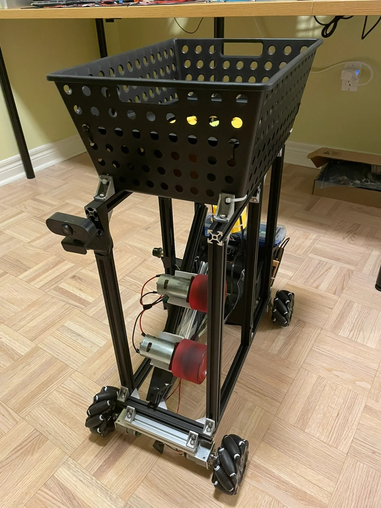
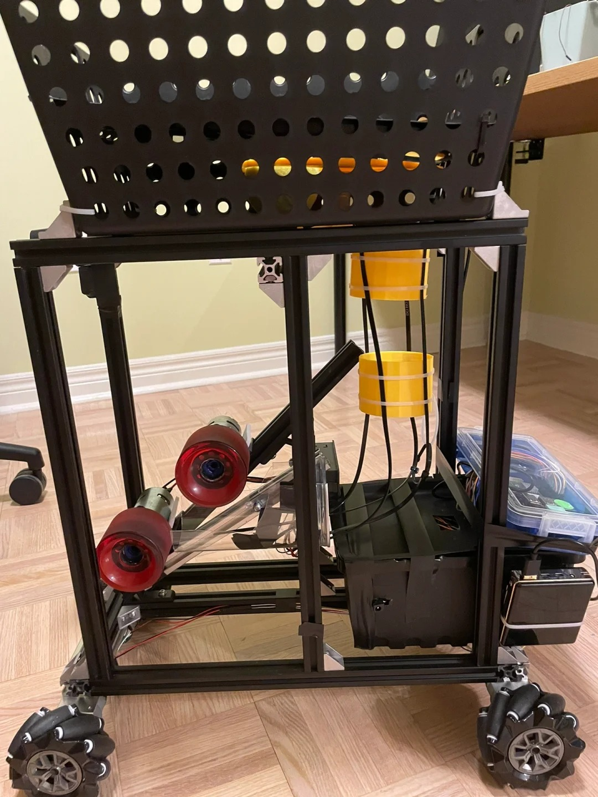
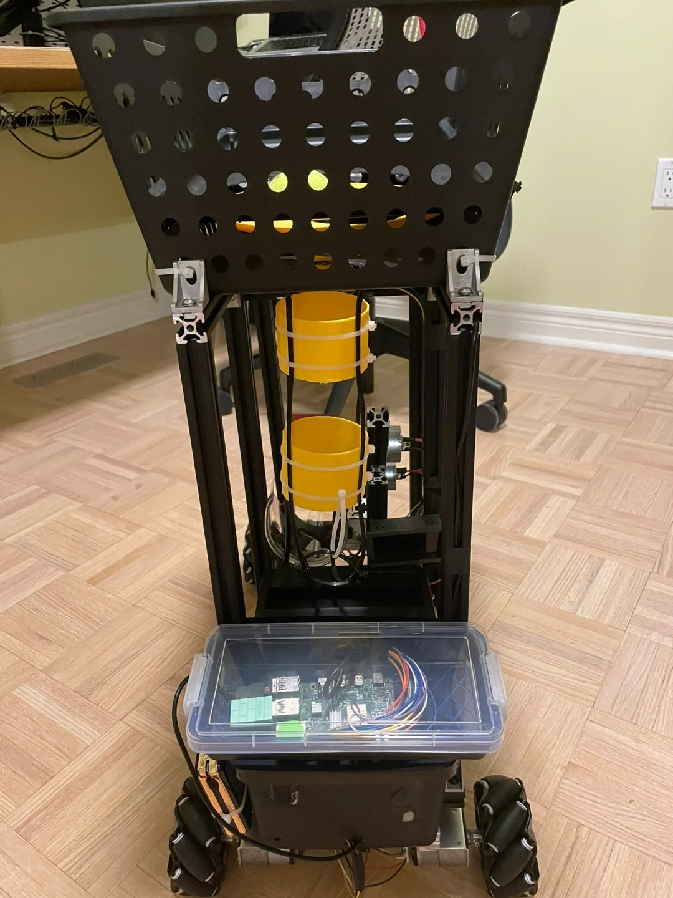
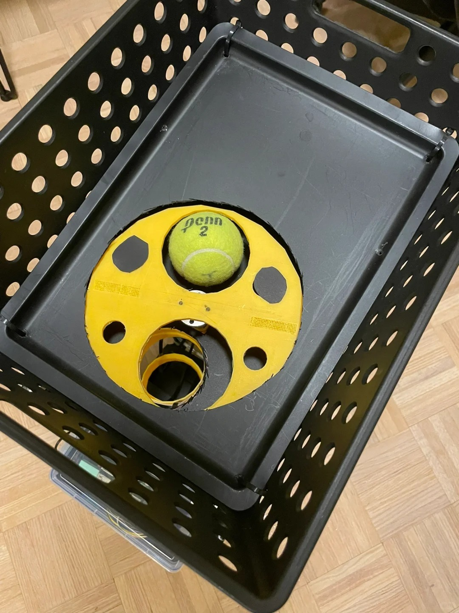
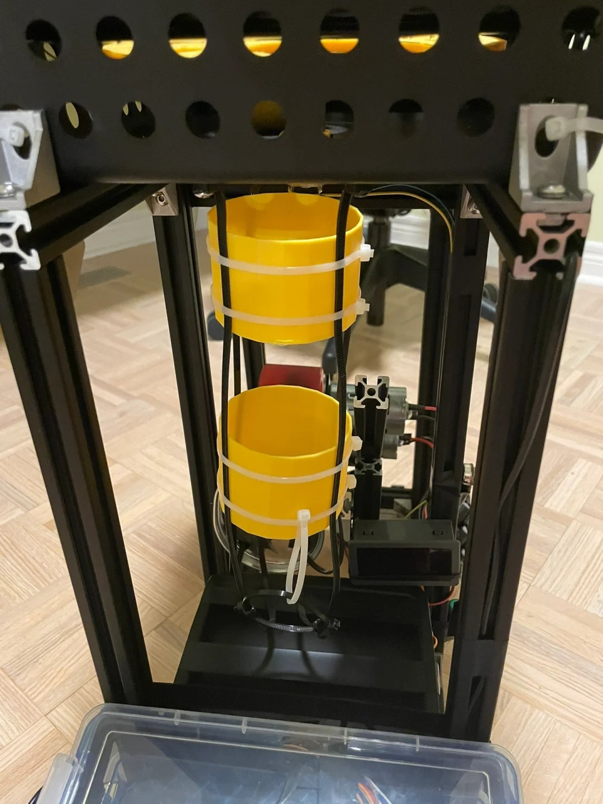

# OpenTennisTrainingBot 🎾🤖

开源网球训练机器人系统，包含硬件设计、固件和控制软件 - 让你的网球训练更智能！

## 项目概览

OpenTennisTrainingBot是一个智能化的开源网球发球机解决方案，旨在为个人玩家和教练提供专业级的训练体验。

## 主要特性

- **智能发球系统**：
- **高级旋转控制**：精确的上旋、下旋组合
- **训练模式**：可编程训练方案和随机模式
- **多平台控制**：手机App/Web界面/物理控制面板
- **模块化设计**：易于维护和升级

## 快速开始

### 硬件组装
参见[详细组装指南](docs/assembly_guide/README.md)

### 固件烧录

